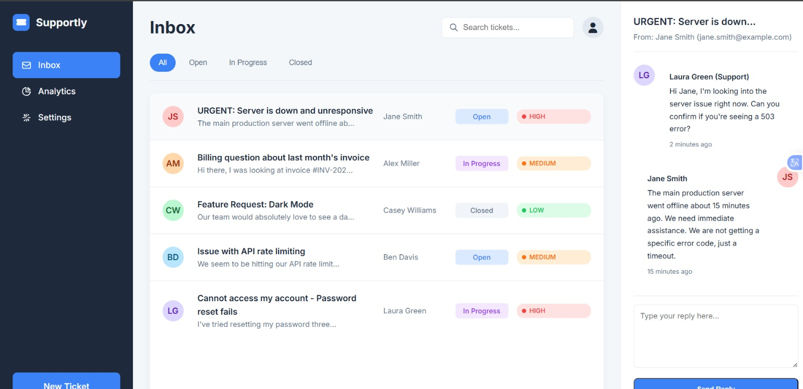
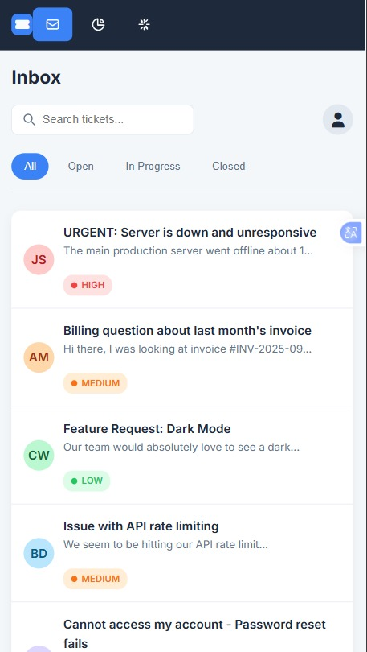

# Support Ticket Dashboard

## Overview
This project is a support ticket dashboard designed to simulate how technical support teams manage and track user issues.

## Problem It Solves
Companies need efficient systems to:
- Track user complaints
- Manage support requests
- Organize and resolve issues quickly

This dashboard demonstrates how support workflows can be structured.

## Features
- Display of support tickets
- Organized layout for issue tracking
- Clear categorization of user problems

## Problems I Solved
- Structured support data for clarity
- Designed interface for easy issue tracking
- Improved usability for managing multiple tickets

## Preview

## Technologies Used
- HTML
- CSS

## How to Use
1. Open the dashboard
2. View and track support tickets
3. Navigate through different sections
4. Open Inboxes

## Future Improvements
- Add ticket status updates (open, closed, pending)
- Integrate backend/database
- Add user authentication

## Lessons Learned
- Understanding support workflows
- Designing systems for real-world use
- Improving user interface for productivity

## Live Demo
[View Live Project](https://amarachi-victoria.github.io/support-ticket-dashboard/)
